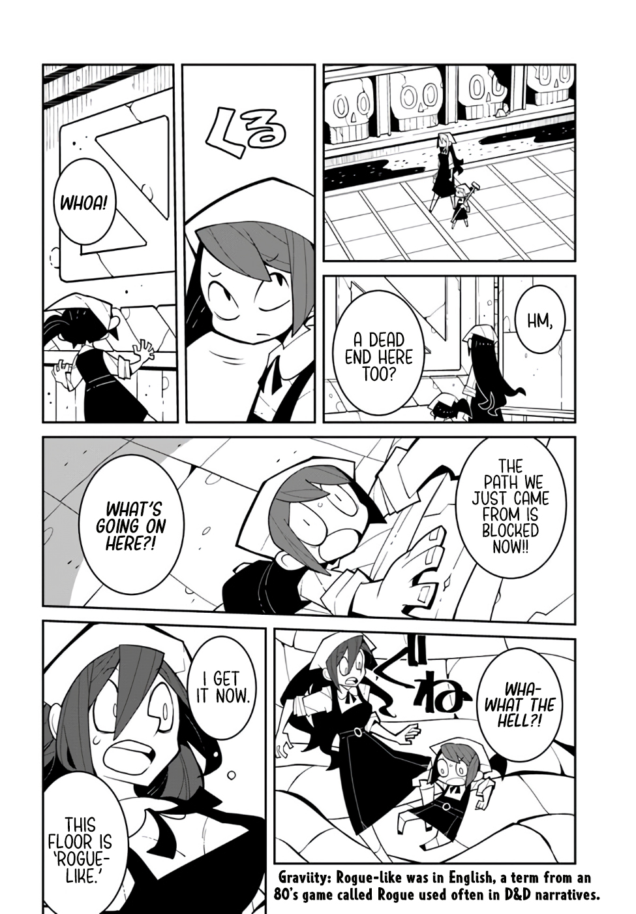

[volver](./README.md)

---
1. > hm
2. > Otro callejon sin salida?
---
---
3. > Ah!
---
4. > Tambien se bloqueo desde donde venimos!
5. > que esta pasando aqui?1
---
6. > que chingados?!
---
7. > ya lo entendi
8. > este piso es un Rogue-Like
---
> Rogue-Like es un termino en ingles para juegos que se asemejan a Rogue (1980)

