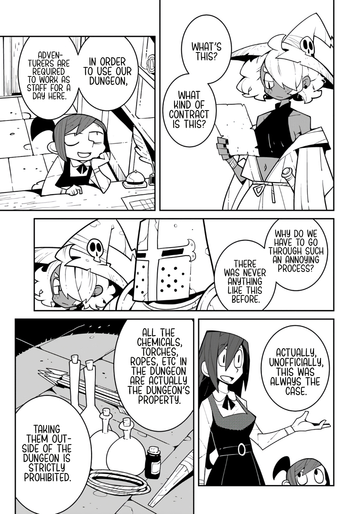

[volver](./README.md)

1. > que es esto
2. > que clase de contrato es esto?
---
3. > para usar nuestra dungeon
4. > los aventureros tienen que trabajar como conserjes por un dia
---
5. > por que tenemos que pasar ese proceso tan cansado?
6. > nunca hubo algo como esto antes
---
7. > de hecho, de manera no oficial esto era asi siempre
---
8. > todos los quimicos, antorchas, cuerdas, etc en la dungeon de hecho son propiedad de la misma
9. > sacarlos de la dungeon esta estrictamente prohibido

